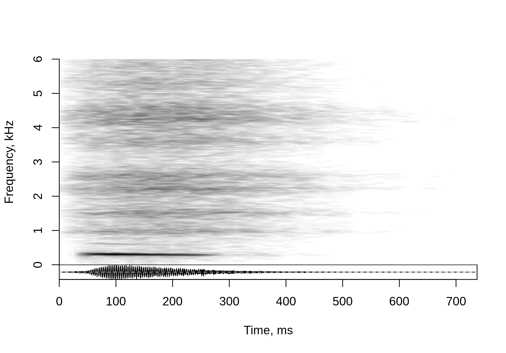
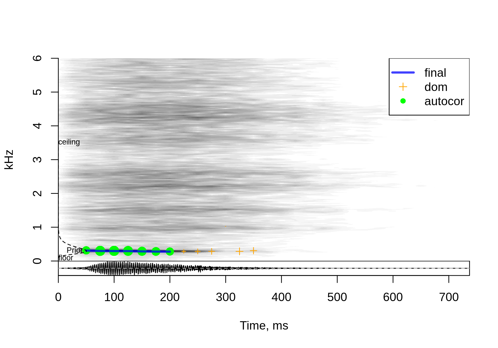

<!-- README.md is generated from README.Rmd. Please edit that file -->
[](https://cran.r-project.org/package=soundgen)
[](https://CRAN.R-project.org/package=soundgen)

R package for sound synthesis and acoustic analysis.  
Homepage with help, demos, etc:
<a href="http://cogsci.se/soundgen.html" class="uri">http://cogsci.se/soundgen.html</a>  
Source code on github:
<a href="https://github.com/tatters/soundgen" class="uri">https://github.com/tatters/soundgen</a>

Performs parametric synthesis of sounds with harmonic and noise
components such as animal vocalizations or human voice. Also includes
tools for spectral analysis, pitch tracking, audio segmentation,
self-similarity matrices, morphing, etc.

Key functions
=============

-   Sound synthesis from R console: `soundgen()`
-   Shiny app for sound synthesis (opens in a browser): `soungen_app()`
-   Acoustic analysis of a wav/mp3 file: `analyze()`
-   Shiny app for editing intonation contours (opens in a browser):
    `pitch_app()`
-   Measuring syllables, pauses, and bursts in a wav/mp3 file:
    `segment()`

For more information, please see the vignettes on sound synthesis and
acoustic analysis:

`vignette("sound_generation", package="soundgen")`

`vignette("acoustic_analysis", package="soundgen")`

Or, to open the vignettes in a browser:  
`RShowDoc('sound_generation', package = 'soundgen')`

`RShowDoc('acoustic_analysis', package = 'soundgen')`

Example of sound synthesis
==========================

Use the `soundgen()` function to create a breathy moan:

``` r
s = soundgen(
  sylLen = 230,               # duration of voiced part, ms
  pitch = c(305, 280),        # pitch, Hz (goes down from 305 to 380 Hz)
  ampl = c(0, -20),           # amplitude, dB (gradual fade-out by 20 dB)
  rolloff = -30,              # strong f0, weak harmonics
  temperature = 0.05,         # some stochasticity in generation
  formants = c(260, 960, 1500, 2200,  # F1-F8 formant frequencies, Hz
               2600, 3600, 4200, 4500),
  noise = data.frame(
    time = c(-50, 120, 700),  # time of noise anchors
    value = c(-15, -5, -50)   # noise amplitude, dB
  ),
  rolloffNoise = 0,           # flat noise spectrum before adding formants
  addSilence = 0, samplingRate = 44100, pitchSamplingRate = 44100,
  play = TRUE, plot = TRUE, osc = TRUE, ylim = c(0, 6)
)
```



<audio controls style = "display: block">
<source src="man/figures/s.mp3" type="audio/mp3">
</audio>
Example of acoustic analysis
============================

Use the `analyze()` function to detect pitch and obtain other spectral
descriptives of the sound we have just synthesized:

``` r
a = analyze(s, 44100, ylim = c(0, 6))
#> Scale not specified. Assuming that max amplitude is 1
```



``` r
a[1:5, c('pitch', 'peakFreq', 'harmHeight', 'HNR', 'ampl', 'loudness')]
#>      pitch peakFreq harmHeight       HNR       ampl loudness
#> 1       NA       NA         NA        NA 0.02604963       NA
#> 2 301.0468 305.2747   595.0474  3.913915 0.15780607 10.54735
#> 3 298.1527 305.2747   596.3055 12.613324 0.36012953 18.57986
#> 4 297.5237 305.2747   595.0474 13.537997 0.48173022 22.58042
#> 5 296.0084 305.2747   813.8656 12.078614 0.46387642 21.87924
colnames(a)
#>  [1] "duration"           "duration_noSilence" "time"               "ampl"              
#>  [5] "amplVoiced"         "dom"                "entropy"            "f1_freq"           
#>  [9] "f1_width"           "f2_freq"            "f2_width"           "f3_freq"           
#> [13] "f3_width"           "harmEnergy"         "harmHeight"         "HNR"               
#> [17] "loudness"           "peakFreq"           "pitch"              "quartile25"        
#> [21] "quartile50"         "quartile75"         "specCentroid"       "specSlope"         
#> [25] "voiced"
```

Installation
============

To install the current release from CRAN: `install.packages("soundgen")`

NB: Make sure all dependencies have been installed correctly! For
problems with seewave, see
<a href="http://rug.mnhn.fr/seewave/" class="uri">http://rug.mnhn.fr/seewave/</a>

On Macs, you may need to do the following:

-   First install brew according to the instructions here:
    <a href="https://brew.sh/" class="uri">https://brew.sh/</a>
-   Then run the following from the terminal  
    `brew install libsndfile`  
    `brew install fftw`
-   Finally, install soundgen in R:  
    `install.packages("soundgen")`
